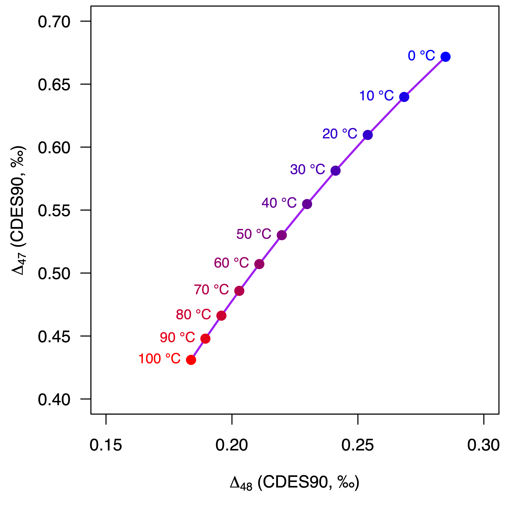

<!-- README.md is generated from README.Rmd. Please edit that file -->

```{r, include = FALSE}
knitr::opts_chunk$set(
  collapse = TRUE,
  comment = "#>",
  fig.path = "tools/README-",
  out.width = "100%"
)
```

# isogeochem: Tools For Carbonate Isotope Geochemistry

**Author:** [David Bajnai](https://www.davidbajnai.eu/)<br/>
**License:** [CC-BY 4.0](https://creativecommons.org/licenses/by/4.0/)

<!-- badges: start -->
[](https://lifecycle.r-lib.org/articles/stages.html#experimental)
[](https://CRAN.R-project.org/package=isogeochem)
[](https://github.com/davidbajnai/isogeochem/actions)
<!-- badges: end -->

This package is a collection of functions that makes working with stable oxygen and clumped isotope data easier.

## Installation

You can install the development version from Github with devtools:

``` r
install.packages("devtools")
devtools::install_github("davidbajnai/isogeochem")
```

## Example 1: Triple oxygen isotopes

The `d17O()` and `d18O()` functions calculate equilibrium oxygen isotope values for given temperature and ambient water composition.

``` r
library(isogeochem)
if (!require("shades")) install.packages("shades"); library(shades)

# Model equilibrium carbonate
temp  = seq(0, 100, 10) # temperature range: 0—100 °C
D47c = D47(temp) # equilibrium ∆47 values
D48c = D48(temp) # equilibrium ∆48 values

# Plot equilibrium calcite ∆47 vs ∆48
plot(0, type="l", axes=T, ylim=c(0.4,0.7), xlim=c(0.15,0.3),
     ylab=expression(Delta[47]*" (CDES90, ‰)"), xlab=expression(Delta[48]*" (CDES90, ‰)"),
     lty=0, font=1, cex.lab=1, las = 1)

lines (D48c, D47c, col="purple", lwd=2) # equilibrium curve
points(D48c, D47c, col=shades::gradient(c("blue","red"),length(temp)),
       pch=19, cex=1.2) # equilibrium points

text(  D48(temps), D47(temps), paste(temp,"°C"), 
       col=shades::gradient(c("blue","red"),length(temp)), pos=2, cex=0.8)
```


## Example 2: Dual clumped isotope thermometry

The `D47()` and `D48()` functions calculate equilibrium oxygen clumped isotope values for given temperature.

``` r
library(isogeochem)
if (!require("shades")) install.packages("shades"); library(shades)

# Model equilibrium carbonate
temp  = seq(0, 50, 10) # temperature range: 0—50 °C
d18Ow = -1
d18Op = prime(d17O(temp,d18Ow)[,1]) # equilibrium d'18O values
D17O  = prime(d17O(temp,d18Ow)[,3]) # equilibrium ∆17O values

# Model meteoric diagenetic alteration
equil = d17O(10, d18Ow) # equilibrium endmember
diage = d17O(25, -10  ) # diagenetic endmember
mix   = mix_d17O(equil[1],equil[2],diage[1],diage[2]) # model mixing between the endmembers

# Plot equilibrium calcite ∆17O vs d'18O
plot(0, type="l", axes=T, ylim=c(-0.1,-0.04), xlim=c(15,40),
     ylab=expression(delta*"'"^18*"O"[c]*" (‰, VSMOW)"), xlab=expression(Delta^17*"O (‰, VSMOW)"),
     lty=0, font=1, cex.lab=1, las = 1)

lines( d18Op, D17O, col="purple", lwd=2) # equilibrium curve
points(d18Op, D17O, col=shades::gradient(c("blue","red"), length(temp)),
       pch=19, cex=1.2) # equilibrium points

lines( prime(mix[,1]), mix[,2], col="tan4", lty=2, lwd=2) # diagenetic curve
points(prime(mix[,1]), mix[,2], col=shades::gradient(c("#3300CC","tan4"),length(seq(0,10,1))),
       pch=18, cex=1.2) # diagenetic points

text(  d18Op+0.5, D17O,
       paste(temp,"°C"),
       col=shades::gradient(c("blue","red"),length(temp)), pos=4, cex=1)
text(  prime(mix[,1]), mix[,2],
       paste(seq(0,10,1)*10,"%"),
       col=shades::gradient(c("#3300CC","tan4"),length(seq(0,10,1))), pos=1, cex=0.5)
```

