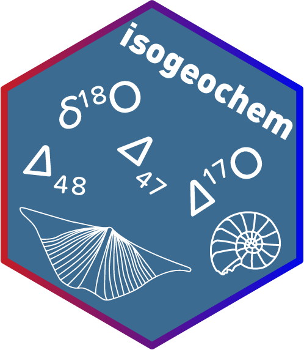
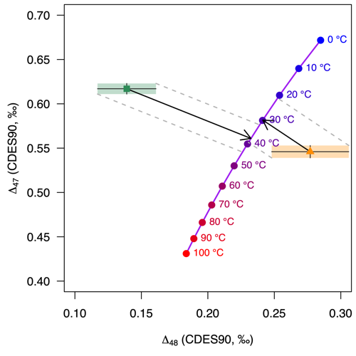
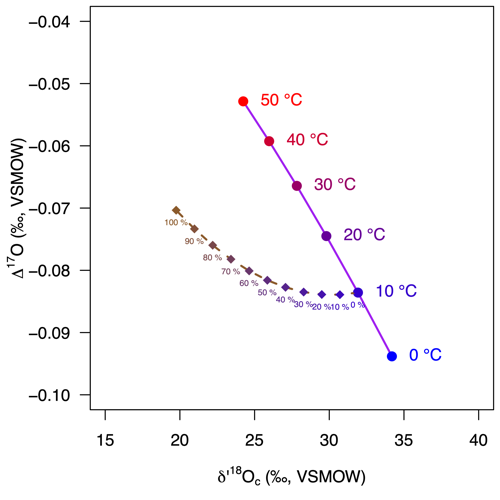

<!-- README.md is generated from README.Rmd. Please edit that file -->

```{r, include = FALSE}
knitr::opts_chunk$set(
  collapse = TRUE,
  comment = "#>",
  fig.path = "/man/figures",
  out.width = "100%"
)
```

# isogeochem:  <br> Tools for carbonate isotope geochemistry

**Author:** [David Bajnai](https://www.davidbajnai.eu/)<br/>
**Contributors:** Julian Tödter <br/>
**License:** [GPL-3](https://opensource.org/licenses/GPL-3.0)

<!-- badges: start -->
[](https://github.com/davidbajnai/isogeochem/actions)
[](https://codecov.io/gh/davidbajnai/isogeochem?branch=main)
[](https://www.repostatus.org/#active)
[](https://CRAN.R-project.org/package=isogeochem)
[](https://zenodo.org/badge/latestdoi/401782303)
<!-- badges: end -->

`isogeochem` aims to make working with stable oxygen, carbon, and clumped isotope data reproducible and straightforward. It offers tools to quickly calculate:

* equilibrium carbonate *δ*<sup>18</sup>O, *δ*<sup>17</sup>O, *∆*<sub>47</sub>, and *∆*<sub>48</sub> values
* carbonate growth temperatures from *δ*<sup>18</sup>O, *∆*<sub>47</sub>, and *∆*<sub>48</sub> values
* isotope fractionation factors, e.g., between carbonate and water
* model DIC speciation as a function of temperature, pH, and salinity
* convert between the VSMOW and VPDB scales

Look at the [.pdf manual](isogeochem_manual.pdf) for the available list of calibrations and mineralogies.

This package is work in progress. Please get in touch if you have any suggestions! Contributors are acknowledged.

## Installation

This package is not on CRAN yet.<br/>
You can install the development version from Github with devtools:

``` {r, include = TRUE, message = FALSE, eval = FALSE}
if (!require("devtools")) install.packages("devtools")
devtools::install_github("davidbajnai/isogeochem")
```

## Dual clumped isotope thermometry

Use `D47()` and `D48()` to calculate equilibrium carbonate clumped isotope values (*∆*<sub>47</sub>, *∆*<sub>48</sub>) for a given temperature. `temp_D47()` calculates carbonate growth temperatures from *∆*<sub>47</sub> values, while `temp_D48()` calculates growth temperature corrected for kinetic effects considering both the *∆*<sub>47</sub> and the *∆*<sub>48</sub> value.

``` {r, include = TRUE, message = FALSE, eval = FALSE}
library(isogeochem)
if (!require("shades")) install.packages("shades")

# Model equilibrium carbonate ∆47 and ∆48 values
temp  = seq(0, 100, 10) # temperature range: 0—100 °C
D47eq = D47(temp, eq = "Fiebig21")
D48eq = D48(temp, eq = "Fiebig21") 

# Sample data
D47_coral  = 0.617; D47_coral_err  = 0.006
D48_coral  = 0.139; D48_coral_err  = 0.022
D47_speleo = 0.546; D47_speleo_err  = 0.007
D48_speleo = 0.277; D48_speleo_err  = 0.029

## Plot in ∆47 vs ∆48 space ##
plot(0, type = "l", axes = TRUE, ylim = c(0.4, 0.7), xlim = c(0.1, 0.3),
     ylab = expression(Delta[47] * " (CDES90, ‰)"),
     xlab = expression(Delta[48] * " (CDES90, ‰)"),
     lty = 0, font = 1, cex.lab = 1, las = 1)

# Plot the equilibrium curve and points
lines (D48eq, D47eq, col = "purple", lwd = 2)
points(D48eq, D47eq, col = shades::gradient(c("blue", "red"), length(temp)),
       pch = 19, cex = 1.2)

# Plot the sample data,
# ... the kinetic slopes,
# ... and calculate growth temperatures corrected for kinetic effects
# ... using a single function!
temp_D48(D47_coral, D48_coral, D47_coral_err, D48_coral_err, ks = -0.6,
         add = TRUE, col = "seagreen", pch = 15)
temp_D48(D47_speleo, D48_speleo, D47_speleo_err, D48_speleo_err, ks = -1,
         add = TRUE, col = "darkorange", pch = 17)

# Add labels to the plot
text(D48(temp, eq = "Fiebig21"), D47(temp, eq = "Fiebig21"), paste(temp, "°C"),
     col = shades::gradient(c("blue", "red"), length(temp)), pos = 4, cex = 0.8)
```


## Triple oxygen isotopes

`d17O_c()` calculates equilibrium carbonate oxygen isotope values (*δ*<sup>18</sup>O, *δ*<sup>17</sup>O, *∆*<sup>17</sup>O) for a given temperature and ambient water composition. Use the `mix_d17O()` function to calculate mixing curves in triple oxygen isotope space, e.g., for modeling diagenesis.

``` {r, include = TRUE, message = FALSE, eval = FALSE}
library(isogeochem)
if (!require("shades")) install.packages("shades")

# Model equilibrium calcite
temp  = seq(0, 50, 10) # temperature range: 0—50 °C
d18O_H2O = -1
d18Op = prime(d17O_c(temp, d18O_H2O, eq18 = "Daeron19")[, 1])
D17O  = prime(d17O_c(temp, d18O_H2O, eq18 = "Daeron19")[, 3])

# Model progressing meteoric diagenetic alteration 
em_equi = d17O_c(10, d18O_H2O, eq18 = "Daeron19") # equilibrium endmember
em_diag = d17O_c(25, -10, eq18 = "Daeron19") # diagenetic endmember
mix = mix_d17O(d18O_A = em_equi[1], d17O_A = em_equi[2],
               d18O_B = em_diag[1], d17O_B = em_diag[2])

## Plot in ∆17O vs d'18O space ##
plot(0, type = "l", axes = TRUE, ylim = c(-0.1,-0.04), xlim = c(15, 40),
     xlab = expression(delta * "'" ^ 18 * "O"[c] * " (‰, VSMOW)"),
     ylab = expression(Delta ^ 17 * "O (‰, VSMOW)"),
     lty = 0, font = 1, cex.lab = 1, las = 1)

# Plot the equilibrium curve and points
lines(d18Op, D17O, col = "purple", lwd = 2)
points(d18Op, D17O, col = shades::gradient(c("blue", "red"), length(temp)),
       pch = 19, cex = 1.2)

# Plot the mixing model between the equilibrium and diagenetic endmembers
lines(prime(mix[, 1]), mix[, 2], col = "tan4", lty = 2, lwd = 2)
points(prime(mix[, 1]), mix[, 2],
       col = shades::gradient(c("#3300CC", "tan4"), length(seq(0, 10, 1))),
       pch = 18, cex = 1.2)

# Add labels to the plot
text(d18Op + 0.5, D17O, paste(temp, "°C"), pos = 4, cex = 1,
     col = shades::gradient(c("blue", "red"), length(temp)))
text(prime(mix[, 1]), mix[, 2], paste(mix[, 3], "%"), pos = 1, cex = 0.5,
     col = shades::gradient(c("#3300CC", "tan4"), length(seq(0, 10, 1))))
```


## Fractionation factors

Use `isogeochem` to calculate isotope fractionation factors at given temperatures.

``` {r, include = TRUE, message = FALSE, eval = FALSE}
# calcite/water – using Daëron et al. (2021)
a18_c_H2O(temp = 25, min = "calcite", eq = "Daeron19")
# calcite/water – using Kim and O'Neil (1997)
a18_c_H2O(temp = 25, min = "calcite", eq = "KO97")
# aragonite/water – using Grossman & Ku (1986) modified by Dettman et al. (1999)
a18_c_H2O(temp = 25, min = "aragonite", eq = "GK86")
# water/hydroxide ion – using Zeebe (2021)
a18_H2O_OH(temp = 25, eq = "Z21-X3LYP")
```

## Vignettes

Case studies demonstrating the use and scope of the functions are
available as [vignettes](vignettes/)

``` {r, include=TRUE, message = FALSE, eval = FALSE}
browseVignettes("isogeochem")
```

## Utility functions

``` {r, include=TRUE, message = FALSE, eval = FALSE}
# Convert between the VSMOW and VPDB scales:
to_VPDB(10)

# Convert between classical delta and delta prime values:
prime(10)
unprime(9.95)
```

## Datasets

Within `isogeochem` you have quick access to important datasets.

| Name        | Description                                             | Reference                    |
|-------------|---------------------------------------------------------|------------------------------|
| `devilshole`| The original Devils Hole carbonate d18O time series     | Winograd et al. (2006)       |
| `LR04`      | A benthic foraminifera d18O stack                       | Lisiecki & Raymo (2005)      |
| `GTS2020`   | An abridged version of the GTS2020 oxygen isotope stack | Grossman & Joachimski (2020) |


___


## See also

There are several other R packages that complement `isogeochem` and are worth checking out:

[`viridisLite`](https://github.com/sjmgarnier/viridisLite) and `viridis` produce color-blind and black-and-white printer friendly color scales.

[`clumpedr`](https://github.com/isoverse/clumpedr/) works with [isoreader](https://github.com/isoverse/isoreader) to read in raw measurement data and reproducibly process the results to clumped isotope values.

[`seasonalclumped`](https://github.com/nielsjdewinter/seasonalclumped) can be used to reconstruct temperature and salinity variations from seasonal oxygen and clumped isotope records.

[`deeptime`](https://github.com/willgearty/deeptime) adds geological timescales to ggplots.
