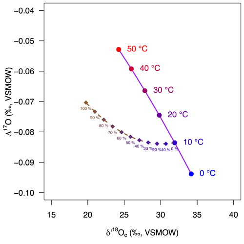

<!-- README.md is generated from README.Rmd. Please edit that file -->

# isogeochem: Tools for carbonate isotope geochemistry

**Author:** [David Bajnai](https://www.davidbajnai.eu/)<br/>
**License:** [GPL-3](https://opensource.org/licenses/GPL-3.0)

<!-- badges: start -->

[](https://lifecycle.r-lib.org/articles/stages.html#experimental)
[](https://www.repostatus.org/#wip)
[](https://CRAN.R-project.org/package=isogeochem)
[](https://github.com/davidbajnai/isogeochem/actions)
<!-- badges: end -->

The aims of `isogeochem` are to make working with stable oxygen, carbon,
and clumped isotope data simple and reproducible.

For the full list of available functions, have a look at the .pdf
manual.

This package is under development. Please get in touch if you have any
suggestions! I appreciate constructive feedback, here on GitHub or via
email.

## Installation

This package is not on CRAN yet.<br/> You can install the development
version from Github with devtools:

``` r
if (!require("devtools")) install.packages("devtools")
devtools::install_github("davidbajnai/isogeochem")
```

## Dual clumped isotope thermometry

Use `D47()` and `D48()` to calculate equilibrium carbonate clumped
isotope values (∆<sub>47</sub>, ∆<sub>48</sub>) for a given temperature.
`temp_D47()` calculates carbonate growth temperatures from
∆<sub>47</sub> values, while `temp_D48()` calculates growth temperature
corrected for kinetic effects considering both the ∆<sub>47</sub> and
the ∆<sub>48</sub> value.

``` r
library(isogeochem)
if (!require("shades")) install.packages("shades")

# Model equilibrium carbonate
temp  = seq(0, 100, 10) # temperature range: 0—100 °C
D47eq = D47(temp, eq = "Fiebig21") # equilibrium ∆47 values
D48eq = D48(temp, eq = "Fiebig21") # equilibrium ∆48 values

# Sample data
D47_coral  = 0.617; D47_coral_err  = 0.006
D48_coral  = 0.139; D48_coral_err  = 0.022
D47_speleo = 0.546; D47_speleo_err  = 0.007
D48_speleo = 0.277; D48_speleo_err  = 0.029

# Plot equilibrium calcite ∆47 vs ∆48
plot(0, type="l", axes=TRUE, ylim=c(0.4, 0.7), xlim = c(0.1, 0.3),
     ylab=expression(Delta[47]*" (CDES90, ‰)"), xlab=expression(Delta[48]*" (CDES90, ‰)"),
     lty=0, font=1, cex.lab=1, las = 1)

lines (D48eq, D47eq, col = "purple", lwd = 2) # equilibrium curve
points(D48eq, D47eq, col=shades::gradient(c("blue", "red"),length(temp)),
       pch=19, cex=1.2) # equilibrium points

# Add the sample data to the plot,
# ... plot the kinetic slopes,
# ... and calculate growth temperatures corrected for kinetic effects
# ... using a single function!
temp_D48(D47_coral, D48_coral, D47_coral_err, D48_coral_err, ks = -0.6,
         add = TRUE, col = "seagreen", pch = 15)
temp_D48(D47_speleo, D48_speleo, D47_speleo_err, D48_speleo_err, ks = -1,
         add = TRUE, col = "darkorange", pch = 17)

text(D48(temp, eq = "Fiebig21"), D47(temp, eq = "Fiebig21"), paste(temp, "°C"),
     col=shades::gradient(c("blue", "red"), length(temp)), pos = 4, cex = 0.8)
```


## Triple oxygen isotopes

`d17O_c()` calculates equilibrium carbonate oxygen isotope values
(δ<sup>18</sup>O, δ<sup>17</sup>O, ∆<sup>17</sup>O) for a given
temperature and ambient water composition. Use the `mix_d17O()` function
to calculate mixing curves in triple oxygen isotope space, e.g., for
modeling diagenesis.

``` r
library(isogeochem)
if (!require("shades")) install.packages("shades")

## Model equilibrium calcite
temp  = seq(0, 50, 10) # temperature range: 0—50 °C
d18O_H2O = -1
d18Op = prime(d17O_c(temp, d18O_H2O, eq18 = "Daeron19")[, 1]) # equilibrium d'18O values
D17O  = prime(d17O_c(temp, d18O_H2O, eq18 = "Daeron19")[, 3]) # equilibrium ∆17O values

## Model progressing meteoric diagenetic alteration 
em_equi = d17O_c(10, d18O_H2O, eq18 = "Daeron19") # equilibrium endmember in mixing model
em_diag = d17O_c(25, -10, eq18 = "Daeron19") # diagenetic endmember in mixing model
# Mixing between the endmembers
mix = mix_d17O(d18O_A = em_equi[1], d17O_A = em_equi[2],
               d18O_B = em_diag[1], d17O_B = em_diag[2])

## Plot equilibrium calcite ∆17O vs d'18O
plot(0, type="l", axes = TRUE, ylim=c(-0.1, -0.04), xlim=c(15, 40),
     xlab = expression(delta*"'"^18*"O"[c]*" (‰, VSMOW)"), ylab = expression(Delta^17*"O (‰, VSMOW)"),
     lty = 0, font = 1, cex.lab = 1, las = 1)

lines(d18Op, D17O, col = "purple", lwd = 2) # equilibrium curve
points(d18Op, D17O,
       col=shades::gradient(c("blue", "red"), length(temp)),
       pch=19, cex=1.2) # equilibrium points

lines(prime(mix[, 1]), mix[, 2], col = "tan4", lty = 2, lwd = 2) # diagenetic curve
points(prime(mix[, 1]), mix[, 2],
       col = shades::gradient(c("#3300CC", "tan4"), length(seq(0, 10, 1))),
       pch=18, cex=1.2) # diagenetic points

text(d18Op+0.5, D17O, paste(temp, "°C"), pos = 4, cex = 1,
     col=shades::gradient(c("blue", "red"), length(temp)))
text(prime(mix[, 1]), mix[, 2], paste(mix[, 3],"%"), pos = 1, cex = 0.5,
     col=shades::gradient(c("#3300CC", "tan4"), length(seq(0, 10, 1))))
```



## Fractionation factors

Use `isogeochem` to calculate isotope fractionation factors “alpha”.
Consult the manual for the available list of functions and equations.

``` r
# calcite / water -- using Daeron et al. (2021) 
  a18_c_H2O(temp = 25, min = "calcite", eq = "Daeron19")
# calcite / water -- using Kim and O'Neil (1997) 
  a18_c_H2O(temp = 25, min = "calcite", eq = "KO97")
# aragonite / water
  a18_c_H2O(temp = 25, min = "aragonite", eq = "Dettman99")
# water/hydroxide ion
  a18_H2O_OH(temp = 25, eq = "Z21-X3LYP")
```

## Vignettes

Case studies demonstrating the use and scope of the functions are
available as vignettes.

``` r
browseVignettes("isogeochem")
```

## Utility functions

``` r
# Convert between the VSMOW and VPDB scales:
to_VPDB(10)

# Convert between classical delta and delta prime values
prime(10)
unprime(9.95)
```

## Datasets

Several datasets are available within the package.

| Name         | Description                                             | Reference                    |
|--------------|---------------------------------------------------------|------------------------------|
| `devilshole` | The original Devils Hole carbonate d18O time series     | Winograd et al. (2006)       |
| `LR04`       | A benthic foraminifera d18O stack                       | Lisiecki & Raymo (2005)      |
| `GTS2020`    | An abridged version of the GTS2020 oxygen isotope stack | Grossman & Joachimski (2020) |
