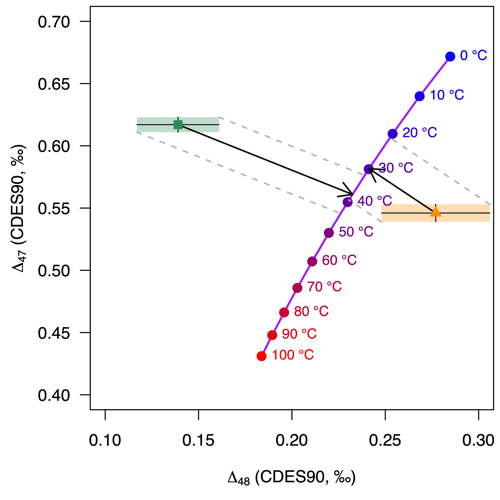

<!-- README.md is generated from README.Rmd. Please edit that file -->

# isogeochem: Tools for carbonate isotope geochemistry

**Author:** [David Bajnai](https://www.davidbajnai.eu/)<br/>
**License:** [GPL-3](https://opensource.org/licenses/GPL-3.0)

<!-- badges: start -->

[](https://lifecycle.r-lib.org/articles/stages.html#experimental)
[](https://CRAN.R-project.org/package=isogeochem)
[](https://github.com/davidbajnai/isogeochem/actions)
<!-- badges: end -->

The aim of this package is to make working with stable oxygen and
clumped isotope data simpler and more reproducible. For the full list of
available functions, have a look at the .pdf manual.

## Under developement

This package is under development and needs to be reviewed.<br/> Please
get in touch if you have any suggestions! I appreciate constructive
feedback, here on GitHub or via email.

## Installation

This package is not on CRAN yet.<br/> You can install the development
version from Github with devtools:

``` r
if (!require("devtools")) install.packages("devtools")
devtools::install_github("davidbajnai/isogeochem")
```

## Dual clumped isotope thermometry

The `D47c` and `D48c()` functions calculate equilibrium carbonate
clumped isotope values (∆<sub>47</sub>, ∆<sub>48</sub>) for a given
temperature.

``` r
library(isogeochem)
if (!require("shades")) install.packages("shades")

# Model equilibrium carbonate
temp  = seq(0, 100, 10) # temperature range: 0—100 °C
D47eq = D47c(temp, eq = "Fiebig21") # equilibrium ∆47 values
D48eq = D48c(temp, eq = "Fiebig21") # equilibrium ∆48 values

# Sample data
D47coral  = 0.617; D47coral_err  = 0.006
D48coral  = 0.139; D48coral_err  = 0.022
D47speleo = 0.546; D47speleo_err  = 0.007
D48speleo = 0.277; D48speleo_err  = 0.029

# Plot equilibrium calcite ∆47 vs ∆48
plot(0, type="l", axes=T, ylim=c(0.4,0.7), xlim=c(0.1,0.3),
     ylab=expression(Delta[47]*" (CDES90, ‰)"), xlab=expression(Delta[48]*" (CDES90, ‰)"),
     lty=0, font=1, cex.lab=1, las = 1)

lines (D48eq, D47eq, col="purple", lwd=2) # equilibrium curve
points(D48eq, D47eq, col=shades::gradient(c("blue","red"),length(temp)),
       pch=19, cex=1.2) # equilibrium points

# Add the sample data to the plot,
# ... plot the kinetic slopes,
# ... and calculate growth temperatures corrected for kinetic effects
# ... using a single function!
temp_D48(D47coral, D48coral, D47coral_err, D48coral_err, ks = -0.6,
         add = TRUE, col = "seagreen", pch = 15)
temp_D48(D47speleo, D48speleo, D47speleo_err, D48speleo_err, ks = -1,
         add = TRUE, col = "darkorange", pch = 17)

text(D48c(temp), D47c(temp), paste(temp,"°C"),
     col=shades::gradient(c("blue","red"),length(temp)), pos=4, cex=0.8)
```



## Triple oxygen isotopes

The `d17Oc()` function calculates equilibrium carbonate oxygen isotope
values (δ<sup>18</sup>O, δ<sup>17</sup>O, ∆<sup>17</sup>O) for a given
temperature and ambient water composition. Use the `mix_d17O()` function
to calculate mixing curves in triple oxygen isotope space, e.g., for
modeling diagenesis.

``` r
library(isogeochem)
if (!require("shades")) install.packages("shades")

## Model equilibrium carbonate
temp  = seq(0, 50, 10) # temperature range: 0—50 °C
d18Ow = -1
d18Op = prime(d17Oc(temp, d18Ow, eq18 = "Daeron19")[,1]) # equilibrium d'18O values
D17O  = prime(d17Oc(temp, d18Ow, eq18 = "Daeron19")[,3]) # equilibrium ∆17O values

## Model progressing meteoric diagenetic alteration 
em_equi = d17Oc(10, d18Ow, eq18 = "Daeron19") # equilibrium endmember in mixing model
em_diag = d17Oc(25, -10, eq18 = "Daeron19") # diagenetic endmember in mixing model
# Mixing between the endmembers
mix = mix_d17O(d18O_A = em_equi[1], d17O_A = em_equi[2],
               d18O_B = em_diag[1], d17O_B = em_diag[2])

## Plot equilibrium calcite ∆17O vs d'18O
plot(0, type="l", axes=T, ylim=c(-0.1,-0.04), xlim=c(15,40),
     xlab=expression(delta*"'"^18*"O"[c]*" (‰, VSMOW)"), ylab=expression(Delta^17*"O (‰, VSMOW)"),
     lty=0, font=1, cex.lab=1, las = 1)

lines(d18Op, D17O, col="purple", lwd=2) # equilibrium curve
points(d18Op, D17O, col=shades::gradient(c("blue","red"), length(temp)),
       pch=19, cex=1.2) # equilibrium points

lines(prime(mix[,1]), mix[,2], col="tan4", lty=2, lwd=2) # diagenetic curve
points(prime(mix[,1]), mix[,2], col=shades::gradient(c("#3300CC","tan4"),length(seq(0,10,1))),
       pch=18, cex=1.2) # diagenetic points

text(d18Op+0.5, D17O, paste(temp,"°C"), pos=4, cex=1,
     col=shades::gradient(c("blue","red"), length(temp)))
text(prime(mix[,1]), mix[,2], paste(mix[,3],"%"), pos=1, cex=0.5,
     col=shades::gradient(c("#3300CC","tan4"), length(seq(0,10,1))))
```


## … and more!

``` r
# Convert between the VSMOW and VPDB scales:
to_VPDB(10)

# Calculate the oxygen isotope fractionation factor between water and carbonate:
a18c_w(temp = 25, min = "calcite", eq = "Coplen07")
a18c_w(temp = 25, min = "aragonite", eq = "Dettman99")

# Calculate the relative abundance of dissolved inorganic carbon species:
xDIC(temp = 10, ph = 8, S = 30)

# Convert between classical delta and delta prime values
prime(10)
unprime(9.95)
```

Datasets available within the package:

| Name         | Description                                             | Reference                    |
|--------------|---------------------------------------------------------|------------------------------|
| `devilshole` | The original Devils Hole carbonate d18O time series     | Winograd et al. (2006)       |
| `LR04`       | A benthic foraminifera d18O stack                       | Lisiecki & Raymo (2005)      |
| `GTS2020`    | An abridged version of the GTS2020 oxygen isotope stack | Grossman & Joachimski (2020) |
