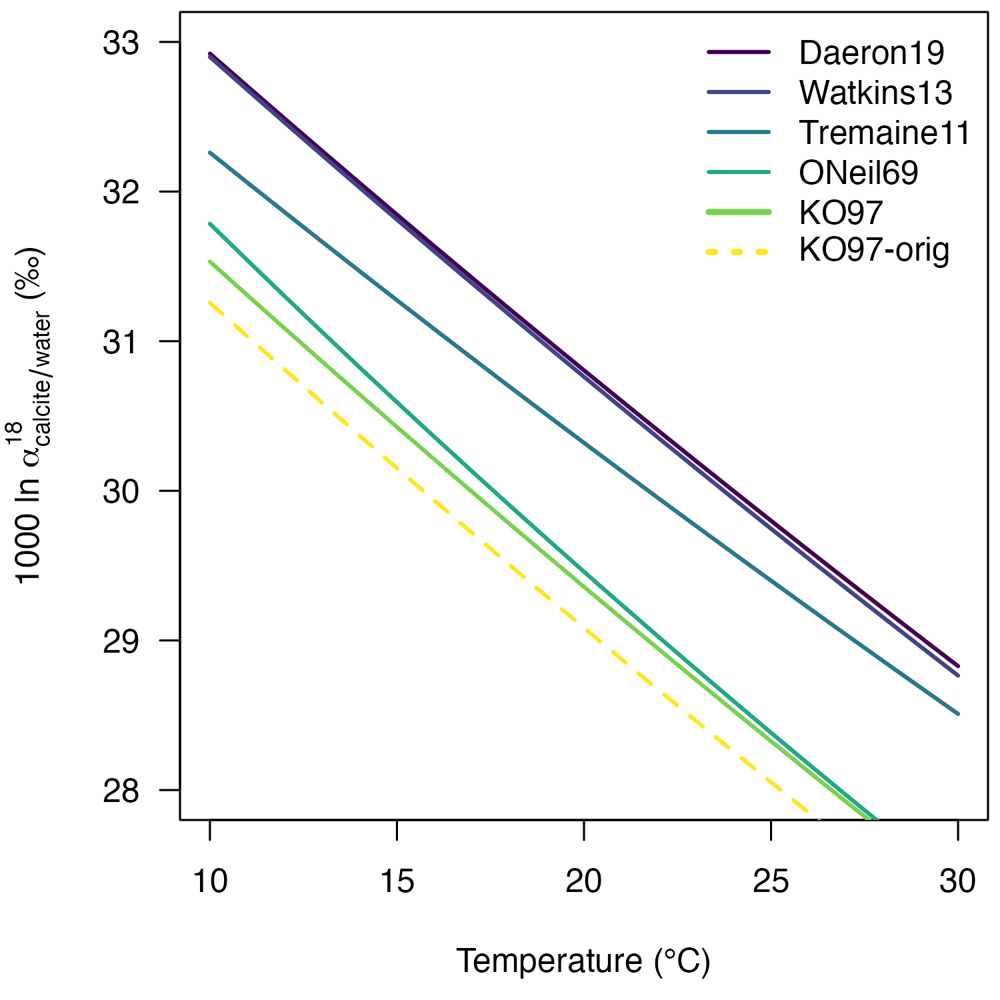

## Introduction

This vignette provides a detailed description of the reprocessing of the
18O/16O fractionation factor between calcite and
water provided by [Kim and O’Neil
(1997)](https://doi.org/10.1016/S0016-7037(97)00169-5):

**103lnα = 18.03 x 1000 / T - 32.42**

To calculate calcite *δ*18O values from the *δ*18O
values of CO2 produced from acid digestion, Kim and O’Neil
(1997) used an 18O/16O acid fractionation factor
(AFF) of 1.01050 at 25 °C. However, the current IUPAC recommendation for
an AFF at 25°C is 1.010254 (see Kim et al. 2007 and 2015). The
difference between calcite *δ*18O values calculated using the
two acid fractionation factors is ca. 0.24‰.

To be able to apply the Kim and O’Neil (1997) equation to calcite
*δ*18O data produced with the IUPAC-recommended acid
fractionation factors and to compare the Kim and O’Neil (1997) equation
with more recent oxygen isotope paleothermometry equations, such as the
Daëron et al. (2019) equation, the original data has to be reprocessed.

## Package setup

Download, install, and load the `isogeochem` package:

    if (!require("isogeochem")) install.packages("isogeochem")
    library("isogeochem")

## Load data

The data is from Table 1 in Kim and O’Neil (1997). All *δ*18O
values are expressed on the VSMOW scale.

    TinC = c(10, 10, 25, 25, 25, 25, 40, 40, 40)
    TinK = 1000 / (TinC + 273.15)
    d18O_H2O = c(-8.12, -8.23, -8.30, -8.25, -8.12, -8.23, -8.20, -8.12, -8.23)
    d18O_calcite = c(23.47, 23.21, 19.73, 20.23, 20.00, 20.03, 17.06, 17.24, 17.01)

## The original equation

Lets reproduce the slope and intercept of the original equation.

    # Calculate the fractionation factor between calcite and water
    a18_calcite_H2O = a_A_B(A = d18O_calcite, B = d18O_H2O)

    # Calculate the 1000ln alpha values, abbreviated here as "elena"
    # Kim and O'Neil (1997) used values rounded to two decimals
    elena_orig = round(1000 * log(a18_calcite_H2O), 2)

    # Fit a linear regression on the values 
    lm_orig = lm(elena_orig ~ TinK)
    slope_orig = round(as.numeric(coef(lm_orig)["TinK"]), 2)
    intercept_orig = round(as.numeric(coef(lm_orig)["(Intercept)"]), 2)

    # The original equation:
    slope_orig
    #> [1] 18.03
    intercept_orig
    #> [1] -32.42

## Reprocess the calcite *δ*18O values

    # Convert d18O_calcite to d18O_CO2acid using the "old" AFF
    d18O_CO2acid = A_from_a(a = 1.01050, B = d18O_calcite)

    # Convert d18O_CO2acid to d18O_calcite using the "new" AFF
    AFF_new = a18_CO2acid_c(25, "calcite")
    d18O_calcite_newAFF = B_from_a(a = AFF_new, d18O_CO2acid)

## Determine the slope and intercept using the new *δ*18O values

    # Calculate the new alpha and 1000ln alpha values
    a18_calcite_H2O_new = a_A_B(A = d18O_calcite_newAFF, B = d18O_H2O)
    elena_new = 1000 * log(a18_calcite_H2O_new)

    # Calculate new slope and intercept
    lm_new = lm(elena_new ~ TinK)
    slope_new = round(as.numeric(coef(lm_new)["TinK"]), 2)
    intercept_new = round(as.numeric(coef(lm_new)["(Intercept)"]), 2)
    slope_new
    #> [1] 18.04
    intercept_new
    #> [1] -32.18

Consequently, the reprocessed equation is:

**103 ln α = 18.04 x 1000 / T - 32.18**

## Visualize the 103lnα vs. temperature relationships

    if (!require("viridisLite")) install.packages("viridisLite")

    plot(0, type = "l", las = 1,
         ylim = c(28, 33),
         xlim = c(10, 30),
         ylab = expression("1000 ln " * alpha[calcite / water] ^ 18 * " (‰)"),
         xlab = "Temperature (°C)")

    temp = seq(10, 30, 1)
    cols = viridisLite::viridis(6, option = "D")

    lines(temp, 1000 * log(a18_c_H2O(temp, "calcite", "Daeron19")),
          col = cols[1], lwd = 2)
    lines(temp, 1000 * log(a18_c_H2O(temp, "calcite", "Watkins13")),
          col = cols[2], lwd = 2)
    lines(temp, 1000 * log(a18_c_H2O(temp, "calcite", "Tremaine11")),
          col = cols[3], lwd = 2)
    lines(temp, 1000 * log(a18_c_H2O(temp, "calcite", "ONeil69")),
          col = cols[4], lwd = 2)
    lines(temp, 1000 * log(a18_c_H2O(temp, "calcite", "KO97")),
          col = cols[5], lwd = 2)
    lines(temp, 1000 * log(a18_c_H2O(temp, "calcite", "KO97-orig")),
          col = cols[6], lwd = 2, lty = 2)

    legend("topright", bty = "n", adj = c(0, NA), 
           lty = c(1, 1, 1, 1, 1, 3),
           lwd = c(2, 2, 2, 2, 3, 3),  
           col = cols,
           legend = c("Daeron19",
                      "Watkins13",
                      "Tremaine11",
                      "ONeil69",
                      "KO97",
                      "KO97-orig"))

